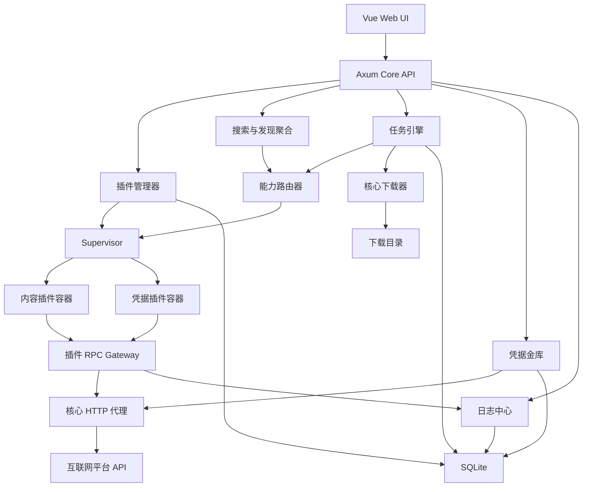

# AudioDown 1.0 插件平台设计

日期：2026-07-11

状态：已完成产品设计，等待用户最终审阅

目标：建设一个不包含任何平台实现、无卡密验证、以受限 Docker 插件提供搜索、发现、凭据和下载解析能力的 AudioDown 1.0。

## 1. 背景与目标

当前 AudioDown 将平台搜索、发现、账号、解析、下载和授权逻辑集中在核心程序中。平台变化会直接要求发布核心版本，平台代码也无法与核心项目隔离。

AudioDown 1.0 采用全新项目，而不是在旧项目中原地重构。旧版继续保留可运行状态，新版建立独立目录和 GitHub 仓库。

新版目标：

- 核心不包含任何真实平台名称、域名、Cookie 规则或解析代码。
- 没有安装内容插件时，搜索与发现页保留，但显示插件安装引导。
- 用户填写 GitHub 仓库地址，读取仓库内插件清单并选择安装。
- 内容插件提供搜索、发现、专辑、曲目和平台特定下载解析。
- 凭据插件独立提供扫码、登录状态、刷新和退出流程。
- 插件运行在独立受限 Docker 容器中，默认不能直接访问公网、宿主机文件、核心数据库、下载目录或 Cookie 明文。
- 核心统一负责 HTTP 请求代理、凭据加密、任务编排、实际文件下载、SQLite 和日志。
- 插件协议与语言无关，第一版仅提供 Node.js SDK 和运行器。
- 完全删除卡密、激活码、设备绑定、租约心跳和授权阻断。
- 整理归档、自动更新、非 Node.js Runtime 等能力后续单独设计。

## 2. 项目与仓库划分

本地目录：

```text
/Users/abc/code/Audiodown/          当前旧版，保持可运行
/Users/abc/code/audiodown-1.0/      新核心项目
/Users/abc/code/audiodown-plugins/  本地插件迁移与验证仓库
```

GitHub 规划：

```text
Tafe-Jiang/audiodown-1.0
  公开：核心、Supervisor、插件协议、Node.js SDK、虚拟示例

独立发布账号/audiodown-plugins
  真实平台内容插件和凭据插件
```

插件仓库采用混合模式：首批插件可以放在一个多插件仓库中，协议同时允许其他作者建立自己的多插件仓库。复杂平台后续可以拆成独立仓库。

核心不会内置、推荐或自动安装任何真实平台插件，也不会包含真实插件仓库地址。

## 3. 技术栈

核心：

- Rust 2021+
- Axum
- Tokio
- SQLite + SQLx
- reqwest
- tracing
- JSON-RPC 2.0
- Unix Socket
- OpenAPI

前端：

- Vue 3
- TypeScript
- Vite

凭据：

- 核心生成本机主密钥
- AES-256-GCM 加密凭据
- SQLite 保存密文、Nonce、作用域和元数据

插件：

- 协议与语言无关
- 第一版仅支持 Node.js 22 插件
- 固定 Dockerfile 和固定入口运行器
- 插件不能自带或覆盖 Dockerfile

## 4. 总体架构



## 5. 核心组件边界

### 5.1 audiodown-server

只负责 Axum 路由、静态资源、依赖注入、应用生命周期和优雅关闭，不直接实现插件、任务或下载业务。

### 5.2 audiodown-domain

定义稳定领域模型：

- Plugin、PluginCapability、Platform
- ResourceRef、Album、Track、DiscoverChannel、SearchResult
- Task、TaskItem、TaskEvent
- CredentialScope
- DownloadPlan、DownloadCandidate
- StructuredLog

领域模型不依赖 Docker、HTTP 或 SQLite。

### 5.3 audiodown-storage

使用 SQLx Repository 和 Migration 管理：

- 插件安装记录
- 插件优先级与运行设置
- 任务和任务项
- 凭据密文
- 日志索引
- 下载记录
- 核心配置

SQLite 是唯一事实来源，不再进行 JSON 与 SQLite 双写。

### 5.4 audiodown-plugin-api

定义：

- JSON-RPC 请求和响应
- 清单 Schema
- 能力名称
- 协议版本协商
- 搜索、发现、专辑、曲目结构
- 不透明 ResourceRef
- 下载计划和下载候选
- 凭据流程
- 标准错误码

该层不包含 Docker 实现。

### 5.5 audiodown-plugin-manager

负责：

- 读取用户输入的 GitHub 公共仓库
- 下载默认分支快照并锁定 Commit SHA
- 校验仓库索引和插件清单
- 安装、启用、禁用和卸载
- 插件兼容性
- 默认插件、优先级和失败回退
- 风险授权记录
- 镜像、清单和锁文件哈希

### 5.6 audiodown-plugin-runtime

负责通过 Supervisor：

- 构建插件镜像
- 启停插件容器
- 按需启动与空闲停止
- 常驻模式
- 健康检查
- Unix Socket RPC
- CPU、内存、PID 和临时磁盘限制
- 容器退出、OOM、stdout 和 stderr 捕获

### 5.7 audiodown-network-proxy

插件不直接联网。HTTP 代理负责：

- 域名白名单
- 私网、回环、链路本地和云元数据地址阻断
- DNS Rebinding 防护
- 每次重定向重新校验
- 请求头过滤
- Cookie 注入
- 临时 Cookie Jar
- 超时、压缩和编码
- 请求及响应大小限制
- 脱敏网络日志

### 5.8 audiodown-credential-vault

负责：

- Cookie 和 Token 加密保存
- 凭据作用域
- 临时登录 Cookie Jar
- 登录流程状态
- 删除、轮换和状态信息
- 授权 HTTP 代理使用凭据

插件永远不能读取或导出凭据明文。

### 5.9 audiodown-task-engine

负责：

- 创建下载任务
- 保存插件生成的下载计划
- Worker Pool
- 暂停、恢复和取消
- 逐项地址解析
- 下载地址过期后重新解析
- 失败重试和插件回退
- Core 重启后的任务恢复
- 插件版本和 ResourceRef 兼容检查

### 5.10 audiodown-downloader

负责：

- HTTP 流式下载
- 临时文件和原子重命名
- 断点续传
- 下载进度和速度限制
- 文件格式及大小验证
- 下载目录越界保护
- 下载候选切换

第一阶段不负责整理归档、格式转换或下载后处理。

### 5.11 audiodown-logging

统一记录：

- Core 日志
- Supervisor 日志
- 插件结构化日志
- 插件 stdout 和 stderr
- 插件构建日志
- HTTP 代理日志
- 任务和下载日志

日志由核心补充 pluginId、pluginVersion、platformId、requestId、taskId、containerId 和 timestamp。插件不能伪造核心字段。日志自动脱敏 Cookie、Authorization、Token、手机号和其他敏感字段。

## 6. 双容器部署

用户只维护极简 Compose：

```yaml
services:
  audiodown:
    image: audiodown/core:1.0
    container_name: audiodown
    restart: unless-stopped
    ports:
      - "18080:18080"
    volumes:
      - ./data:/data
      - audiodown-control:/run/audiodown

  supervisor:
    image: audiodown/supervisor:1.0
    container_name: audiodown-supervisor
    restart: unless-stopped
    volumes:
      - /var/run/docker.sock:/var/run/docker.sock
      - ./data/plugins:/data/plugins
      - audiodown-control:/run/audiodown

volumes:
  audiodown-control:
```

Docker Socket 只挂载给 Supervisor，不挂载给公开 Web API 的 Core。

Supervisor 只接受白名单命令，并只管理 installation ID 匹配且带 `io.audiodown.managed=true` 标签的 Core/插件资源。它拒绝任意镜像、任意命令、任意挂载、Host 网络、Host PID、特权模式、设备映射和新增 Linux Capability。

Core 与 Supervisor 使用共享 Unix Socket 通信。身份令牌和安装实例 ID 首次启动时自动生成，用户无需配置。

默认数据目录：

```text
data/
├── audiodown.db
├── config/
├── credentials/
├── downloads/
├── logs/
├── backups/
└── plugins/
```

如果用户额外挂载 `/downloads`，Core 自动优先使用该目录。

## 7. 插件容器安全模型

插件容器由 Supervisor 强制设置：

```text
根文件系统只读
/tmp 使用 64 MB tmpfs，noexec/nosuid/nodev
cap_drop = ALL
no-new-privileges = true
pids_limit = 64
mem_limit = 128 MB
cpus = 0.5
无宿主机端口
无 Host 网络
无 Core 数据目录
无 downloads 目录
无 Docker Socket
```

插件网络为 Supervisor 自动创建的内部网络，无默认公网出口。插件只能连接专用 RPC Gateway，不能访问 Core Web 端口或其他插件容器。

默认生命周期：

- 安装并启用后保持停止状态。
- 搜索、发现、解析、下载或账号操作触发启动。
- 健康检查通过后处理 RPC。
- 无请求、无任务、无登录流程达到 15 分钟后停止。
- 用户可以为特定插件选择“始终运行”。
- 启动失败最多自动重试 3 次，之后标记 unhealthy。

## 8. GitHub 多插件仓库

第一版支持：

- GitHub 公共仓库
- 默认分支
- 根目录 `audiodown-repository.json`
- Node.js 插件
- 安装时锁定 Commit SHA

暂不支持私有仓库、GitHub Token、自动更新和分支跟随。

仓库结构：

```text
audiodown-plugins/
├── audiodown-repository.json
├── README.md
└── plugins/
    ├── platform-content/
    │   ├── audiodown-plugin.json
    │   ├── package.json
    │   ├── package-lock.json
    │   └── src/
    └── platform-credential/
```

仓库索引示例：

```json
{
  "schemaVersion": "1.0",
  "repository": {
    "id": "example.plugins",
    "name": "Example Plugins"
  },
  "plugins": [
    { "path": "plugins/platform-content" },
    { "path": "plugins/platform-credential" }
  ]
}
```

核心校验路径穿越、符号链接逃逸、插件数量、仓库总大小和单文件大小。索引不能引用其他仓库或任意下载地址。

## 9. 插件清单与兼容性

内容插件清单示意：

```json
{
  "schemaVersion": "1.0",
  "id": "com.example.platform.content",
  "name": "示例内容插件",
  "version": "1.0.0",
  "type": "content",
  "runtime": {
    "type": "nodejs",
    "version": "22",
    "entry": "src/index.js"
  },
  "compatibility": {
    "pluginApi": ">=1.0 <2.0",
    "core": ">=1.0 <2.0"
  },
  "platform": {
    "id": "example",
    "name": "示例平台"
  },
  "capabilities": [
    "content.search",
    "content.discover",
    "content.album.get",
    "content.tracks.list",
    "content.download.plan",
    "content.download.resolve"
  ],
  "network": {
    "allowedHosts": ["api.example.com", "*.cdn.example.com"]
  },
  "credentials": {
    "optionalScopes": ["example.web"]
  }
}
```

兼容规则：

- 插件 API 使用语义化版本范围。
- `1.x` 只能进行向后兼容扩展。
- 删除字段和改变语义必须进入 `2.0`。
- 安装和启动前均检查兼容范围。
- 任务保存插件 ID、插件版本、插件 API 版本和 ResourceRef Schema 版本。

## 10. Node.js 构建策略

插件不能提供 Dockerfile。Core/Supervisor 使用固定 Node.js 22 模板。

默认执行：

```bash
npm ci --omit=dev --ignore-scripts
```

要求：

- 必须提交 `package-lock.json`。
- package.json 与锁文件一致。
- 禁止 Git、本地路径和任意 URL 依赖。
- 构建阶段只允许访问 npm Registry。
- 运行阶段完全禁止公网访问。

需要 npm 生命周期脚本时，插件必须声明原因。用户必须开启开发者模式并单独确认。安装脚本只在临时隔离构建容器执行，不能访问宿主机、Docker Socket、Core 数据或凭据。构建输出完整进入日志中心。

## 11. 内容插件与凭据插件

两类插件必须独立安装和升级。

内容插件：

- 搜索
- 发现频道
- 分类和榜单
- 专辑详情
- 曲目分页
- 下载计划
- 逐项下载地址解析

凭据插件：

- 二维码开始和轮询
- 登录状态检查
- 凭据刷新
- 退出登录
- 凭据作用域声明

插件不能注入 HTML、JavaScript 或 Vue 组件。Core 根据标准数据模型和声明式 Schema 渲染所有界面。

## 12. 搜索与发现

同一平台允许安装多个内容插件：

- 用户设置默认插件和优先级。
- 默认插件失败时按错误类型回退。
- 用户可以关闭插件参与搜索聚合或发现页。
- 每个结果展示平台和来源插件。
- 单插件失败不影响其他插件结果。

统一资源标识：

```text
platformId + sourcePluginId + resourceType + resourceId
```

插件可提供 `canonicalId` 用于跨插件去重和历史关联。无法提供稳定 canonicalId 时，Core 不跨插件去重。

搜索分页使用插件生成的不透明 Cursor。Core 不假设页码模型。

发现页首版支持标准布局：

- hero-carousel
- album-grid
- horizontal-list
- ranked-list
- category-grid

插件只能选择布局并提供数据。

无插件时搜索和发现页面保留，显示 GitHub 插件安装入口和空状态说明。

## 13. 平台差异化下载协议

Core 不假设所有平台使用 albumId/trackId。插件返回不透明 `resourceRef`：

```json
{
  "platformId": "example",
  "resourceType": "chapter",
  "resourceRefSchemaVersion": "1",
  "resourceRef": {
    "bookId": "book-123",
    "chapterId": "chapter-456",
    "audioId": "audio-789"
  },
  "canonicalId": "example:book:book-123:chapter:chapter-456"
}
```

Core 只存储、限制大小并原样回传，不解释字段。

下载分三层：

1. `content.download.plan`：插件根据平台规则生成任务项、资源引用、顺序和可用性。
2. `content.download.resolve`：每个任务项下载前，插件执行平台特定请求和签名，返回下载候选。
3. Core Downloader：选择候选并执行真实文件传输、进度、重试、暂停和校验。

第一版支持：

- direct
- resolve-per-item
- batch-resolve

HLS/DASH segmented 下载后续设计。

下载地址失效时，Core 带失败上下文重新调用插件解析。插件可以返回短期不透明状态，但任务持久化必须依赖 ResourceRef，不得依赖插件容器的永久状态。

## 14. 凭据流程

Cookie 获取改为独立凭据插件。

二维码登录：

1. Core 启动凭据插件。
2. 插件请求 Core HTTP 代理获取二维码。
3. Core HTTP 代理维护临时 Cookie Jar。
4. Core UI 渲染二维码。
5. Core 定时调用插件轮询。
6. 登录成功后插件请求将临时 Cookie Jar 提升为凭据作用域。
7. Core 加密保存。

`Set-Cookie` 默认不返回插件。插件只引用 Cookie Jar Session ID。

手工 Cookie 导入由 Core 标准表单完成，明文不经过插件。凭据插件只能请求 Core 使用对应作用域检查账号状态。

卸载凭据插件时，用户选择保留或删除对应凭据；保留凭据仍可被授权的内容插件通过 HTTP 代理使用。

## 15. 统一日志与错误

标准日志字段：

```text
timestamp
level
component
pluginId
pluginVersion
platformId
requestId
taskId
containerId
errorCode
message
context
```

首版标准错误：

```text
PLUGIN_INVALID_REQUEST
PLUGIN_NOT_COMPATIBLE
PLUGIN_START_FAILED
PLUGIN_HEALTH_CHECK_FAILED
PLUGIN_RPC_TIMEOUT
PLUGIN_RPC_DISCONNECTED
PLUGIN_CRASHED
PLUGIN_RESOURCE_LIMIT
NETWORK_HOST_NOT_ALLOWED
NETWORK_PRIVATE_ADDRESS_BLOCKED
NETWORK_TIMEOUT
NETWORK_RESPONSE_TOO_LARGE
CREDENTIAL_NOT_FOUND
CREDENTIAL_EXPIRED
RESOURCE_NOT_FOUND
RESOURCE_ACCESS_DENIED
RESOURCE_NOT_PURCHASED
RESOURCE_TEMPORARILY_UNAVAILABLE
RATE_LIMITED
DOWNLOAD_URL_EXPIRED
DOWNLOAD_FILE_INVALID
PLATFORM_RESPONSE_CHANGED
PLUGIN_INTERNAL_ERROR
```

平台原始错误只进入脱敏日志。UI 展示标准错误和安全摘要。任务引擎根据标准错误码决定重试、回退或等待用户处理。

## 16. 卡密系统移除

AudioDown 1.0 不迁移旧版授权实现。新版不得包含：

- 激活码
- 设备绑定
- 租约和心跳
- 授权服务网络请求
- 授权状态缓存
- 授权设置页
- 授权数据库表
- 搜索、解析或任务启动授权拦截

旧数据导入时，授权数据只允许备份，不进入新数据库。

## 17. 旧数据迁移

第一阶段仅设计迁移接口，不要求完成完整导入工具。

未来导入时保留：

- 下载归档
- 任务历史
- 订阅记录
- 平台凭据
- 平台资源标识

旧数据先标记：

```text
platform_id = 旧平台稳定 ID
source_plugin_id = null
migration_state = waiting_for_plugin
```

安装对应插件后，若插件声明 `migration.claim`，可以接收脱敏资源标识和元数据并返回 canonicalId、新 ResourceRef 及 Schema 版本。无法认领的数据继续只读展示。

旧 Cookie 映射到 Core 凭据作用域，不发送给内容插件。

## 18. 故障处理

插件启动失败：

- 保存 Supervisor 和构建日志。
- 最多自动重试 3 次。
- 标记 unhealthy。
- 允许时尝试下一优先级插件。

插件崩溃：

- 当前 RPC 失败。
- Core 已开始的文件下载不受影响。
- 未解析任务项暂停或切换兼容插件。
- 禁止无限重启循环。

Core 重启：

- SQLite 保留任务。
- 恢复时重新检查任务项。
- 过期下载地址重新解析。
- 不依赖插件容器永久状态。

Supervisor 不可用：

- Core 仍可展示历史、下载文件、缓存日志和核心设置。
- 禁止安装、启动、停止插件和发起新平台请求。
- UI 显示插件管理服务不可用。
- Core 不允许直接连接 Docker Socket 作为回退。

## 19. 第一阶段范围

包含：

- 新 Rust Workspace
- Axum Core
- Vue 3 UI
- SQLite Schema 与 Migration
- 极简双容器 Compose
- Rust Supervisor
- GitHub 多插件仓库读取
- Node.js 固定构建模板和 SDK
- 安装、启停、卸载、优先级和运行模式
- JSON-RPC 插件协议
- 核心 HTTP 代理
- 加密凭据金库
- 搜索、发现、专辑、曲目接口
- 下载计划、逐项解析和 Core Downloader
- 统一日志
- 虚拟内容和凭据插件
- 卡密系统不存在性验证

不包含：

- GitHub 自动更新
- Web 一键升级 Core
- 私有 GitHub 仓库
- 非 Node.js Runtime
- WASM Runtime
- 整理归档
- 下载后处理
- 音频格式转换
- 插件前端页面
- 浏览器自动化登录
- HLS/DASH 分片下载
- 插件市场、评分和推荐
- 完整旧数据导入工具

## 20. 实施与迁移顺序

1. 创建独立 `audiodown-1.0` 和本地 `audiodown-plugins` 目录。
2. 建立 Core、Supervisor、Vue 和插件协议骨架。
3. 建立 SQLite、日志、RPC 和极简 Compose。
4. 建立虚拟内容插件与凭据插件。
5. 完成安装、容器沙箱、按需启动和空闲回收。
6. 完成搜索、发现、专辑和曲目全链路。
7. 完成下载计划、逐项解析和 Core Downloader。
8. 完成凭据临时 Cookie Jar 和加密保存。
9. 完成契约、集成和安全测试。
10. 虚拟插件稳定后，从旧项目迁移最简单的无凭据平台。
11. 再迁移番茄、账号平台和复杂平台。
12. 最后单独设计归档、自动更新和旧数据导入。

## 21. 测试策略

插件契约测试：

- Manifest 和协议握手
- 健康检查
- 搜索、发现、专辑和曲目分页
- Download Plan 和 Resolve
- Cursor 和 ResourceRef
- 标准错误码
- 日志输出
- 超时和取消
- 容器重启恢复
- ResourceRef 兼容性

Core 集成测试：

- GitHub 仓库读取和安全校验
- npm 安装脚本风险授权
- 插件构建和安装
- 按需启动、空闲停止和常驻模式
- 多插件聚合、优先级和回退
- 凭据不向插件泄露
- HTTP 域名白名单、内网阻断和重定向复验
- 地址过期重新解析
- 任务暂停、恢复和取消
- 插件 OOM、崩溃和 RPC 超时
- Supervisor 不可用
- Core 重启恢复

安全测试必须证明插件无法：

- 直接访问公网
- 访问回环、私网、Docker 网关和其他容器
- 读取 Core 数据、下载目录和凭据明文
- 获取 Docker Socket
- 使用 Host 网络、Host PID 或特权模式
- 通过 DNS Rebinding 或重定向绕过域名白名单
- 通过路径穿越或符号链接逃逸插件目录
- 通过日志泄露敏感信息

## 22. 验收标准

无插件时：

- Core 和 Supervisor 可以用极简 Compose 启动。
- Web UI 可访问。
- 搜索和发现显示安装引导。
- 不出现真实平台名称。
- 不存在卡密、激活、设备绑定和授权请求。
- 插件中心可读取用户提供的 GitHub 仓库。
- 任务、下载、日志和设置页面正常工作。

安装虚拟内容插件后：

- 搜索出现插件数据。
- 发现出现插件频道。
- 可打开书籍、分页加载章节。
- 可创建任务并下载测试音频。
- 插件行为进入统一日志。
- 空闲后自动停止。
- 设置常驻后持续运行。

安装虚拟凭据插件后：

- 可执行模拟二维码流程。
- 临时 Cookie Jar 由 Core 维护。
- 凭据加密保存。
- 内容插件不能读取 Cookie 明文。
- HTTP 代理可以使用凭据作用域代发请求。

卸载全部插件后：

- 系统恢复空架子状态。
- 历史任务和下载记录继续可见。
- 依赖卸载插件的任务不可重试。
- Core 和 Supervisor 继续正常运行。
